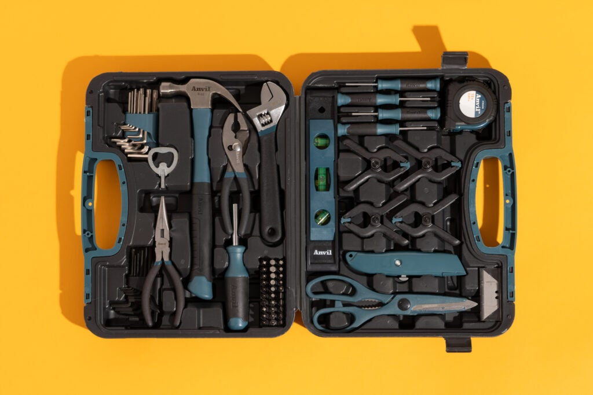

<!-- Products page: 2+ font styles, 1-3 hyperlinks - 1 must be link to relevant site outside of you company site that don't replace website pages in browser window, 1+ pictures, ordered list, unordered list, file that can be downloaded relevant to the company, date the page was last modified-->

<html>
<head>
  <b><h1>Product Offerings</h1></b>
     
</head>

<body>
  All of our products are broken down by <u>category.</u>
   
   
  Here is a quick run down of our products by category:
   
  <i>Please scroll down this page for <b><u>more information</u></b> about a specific product</i>
   
  <ol>
    <li>Personal Tools and Products</li>
    <ul>
       <li>Basic Tool Kit: Includes a hammer, screwdriver, pliers, wrench, screws, nails, and bolts. <i>(You can buy each of these tools individually as well).</i></li>
      <li>Power Drill</li>
      <li>Box Cutter</li>
      <li>Work Bench</li>
    </ul>
    <li>Professional Tools</li>
    <ul>
      <li>Band Saw</li>
      <li>Jackhammer</li>
      <li>Impact Driver</li>
      <li>Nail Gun</li>
    </ul>
    <li>Safety Equipment</li>
    <ul>
      <li>Hard Hat</li>
      <li>High Visibility Vest</li>
      <li>Workmen's Gloves</li>
      <li>Steel Toe Boots</li>
    </ul>
    <li>Professional Materials</li>
    <ul>
      <li>Lumber</li>
      <li>Iron Rods</li>
      <li>Concrete</li>
    </ul>
    <i>If you have questions or want to place a custom materials orders, please email our <a href = "mailto: abbott47@purdue.edu">Materials Specifications Team</a>.</i>
  </ol>
   
   
  Personal Tools and Products
   
   
  Our personal tools are designed for at home use. We offer tools meant for people of all skill levels. Whether you are a beginner or have years of experience, we have the right tools for you. We offer the highest quality tools at competitive prices.
   
   
  
Basic Tool Kit: $54.99

   
   
Our Basic Tool Kit is designed to set you up with the basic tools you will need to start fixing things up. It includes all the basic tools you will need like a hammer, screwdriver, pliers, wrenches, screws, nails, and bolts. 

    

                  
   
  
</body>

   
</html>
